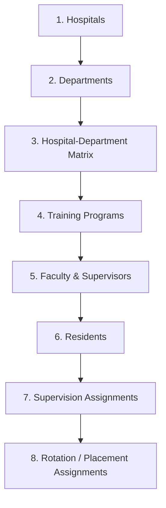

# PGSIMS Onboarding Workflow

This document is a guide for onboarding real hospitals, departments, supervisors, and residents
into PGSIMS, matching the current clean-room identity model and the bulk-import screen at
`/masters` (wired up 2026-07-23 — see `docs/AUDIT_2026-07-23_PILOT_READINESS.md` Step 5).

**Superseded note**: an earlier version of this document referenced lowercase roles
(`supervisor`/`faculty`/`resident`/`pg`), an `HODAssignment` model, and a `SupervisorResidentLink`
model. None of these exist in the current code — roles are `ADMIN`/`RESIDENT`/`SUPERVISOR`/
`SUPPORT_STAFF` (see `docs/USER_ROLES_AND_PERMISSIONS.md`), HOD is at most a free-text
`SupervisorProfile.designation` value (`AGENTS.md` §5), and the resident-supervisor link model is
`ResidentSupervisorAssignment` (`sims.supervision`).

## Two ways to onboard

**One-by-one**, through `/users/new` — the universal identity creation screen for all four roles.
Best for a handful of accounts or corrections.

**In bulk**, through `/masters` — best for the initial pilot roster load. Supports standard-template
CSV/Excel upload with dry-run preview, or a flexible column-mapping mode for spreadsheets that don't
match the template (e.g. exported from Google Forms).

## Bulk onboarding sequence

The `/masters` bulk-import workspace enforces this order (each step's dry-run/apply, template
download, and export live in its own panel):

1. **Hospitals** — `hospital_code`, `hospital_name`, `address`, `phone`, `email`, `active`.
2. **Departments** — `department_code`, `department_name`, `description`, `active`.
3. **Hospital-Department Matrix** — `hospital_code`, `department_code`, `active`.
4. **Training Programs** — `program_code`, `program_name`, `duration_months`, `active`.
5. **Faculty & Supervisors** — `email`, `full_name`, `role` (`faculty`/`supervisor`), `specialty`,
   `department_code`, `hospital_code`, `designation`, `registration_number`, `username`, `password`
   (optional — a temporary password is generated if blank), `active`, `start_date`.
6. **Residents** — `email`, `full_name`, `specialty`, `year`, `pgr_id`, `training_start`,
   `training_end`, `training_level`, `department_code`, `hospital_code`, `supervisor_email`,
   `username`, `password` (optional), `active`.
7. **Supervision Assignments** — `supervisor_email`, `resident_email`, `department_code`,
   `start_date`, `end_date`, `active`.
8. **Rotation / Placement Assignments** — `resident_email`, `hospital_code`, `department_code`,
   `start_date`, `end_date`, `status` (defaults to `DRAFT`), `notes`.

Every bulk-created account gets a temporary password and `must_change_password = True`, exactly like
one created through `/users/new` — the first-login flow (forced password change, then
`/complete-profile` if required fields are still missing) applies the same way regardless of which
path created the account.

## Flexible Column Mapping Import

For spreadsheets that don't match the standard template (e.g. from Google Forms or a third-party
system), use the **"Upload Custom File & Map Columns"** mode on `/masters` instead of the standard
template mode.

1. **Upload & Parse**: choose the target import type, upload the CSV/Excel file, select a sheet if
   the workbook has multiple sheets.
2. **Column Mapping & Auto-Suggestions**: the interface suggests matches from normalized headers
   (e.g. `CustomEmail` → `email`); map any required fields it missed; optionally save the mapping as
   a **Mapping Preset** for future uploads of the same format.
3. **Dry-Run & Preview**: runs the same validation engine as the standard import, in-memory only —
   no database writes. Review the validation summary and download the error report CSV if needed.
4. **Final Import**: **Strict mode** (default) rolls back the whole import if any row errors;
   **Partial mode** imports valid rows and skips/logs the rest.
