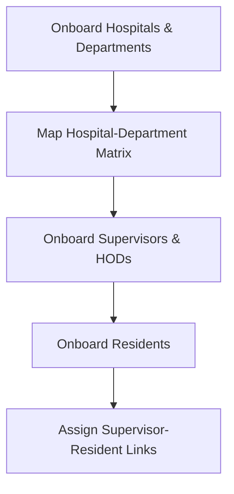

# PGSIMS Onboarding Workflow

This document provides a guide for onboarding clinical users into the PGSIMS platform.

## Onboarding Sequence

## Step 1: Base Configuration
1. **Hospitals**: Added via Django Admin or Bulk CSV (contains hospital code, name, address).
2. **Departments**: Added via Django Admin or Bulk CSV (contains code, name, head).
3. **Hospital-Department Matrix**: Establish matrix rows matching canonical hospitals and departments.

## Step 2: Supervisor & HOD Onboarding
1. **Create User Account**: Role is set to `supervisor` (or `faculty` / `admin`).
2. **Create Staff Profile**: Associates designation, phone, and active status.
3. **Department Membership**: Assign supervisor/faculty to their primary department.
4. **HOD Assignment**: If the supervisor is a department head, create an active `HODAssignment` record.

## Step 3: Resident Onboarding
1. **Create User Account**: Role is set to `resident` (or `pg`).
2. **Create Resident Profile**: Input `pgr_id`, training start date, level, and active status.
3. **Primary Training Affiliation**: Define resident's `home_hospital` and `home_department`.
4. **Resident Training Record**: Register the resident in their specific degree program (e.g. MS-UROLOGY).

## Step 4: Supervisor-Resident Links
- Create a `SupervisorResidentLink` to map the resident to their supervisor for monitoring and review workflows.
