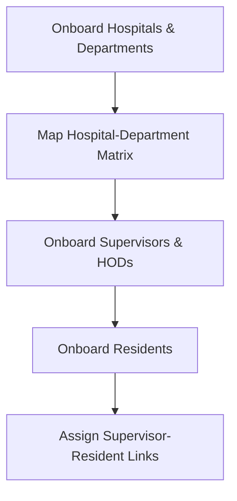

# PGSIMS Onboarding Workflow

This document provides a guide for onboarding clinical users into the PGSIMS platform.

## Onboarding Sequence

## Step 1: Base Configuration
1. **Hospitals**: Added via Django Admin or Bulk CSV (contains hospital code, name, address).
2. **Departments**: Added via Django Admin or Bulk CSV (contains code, name, head).
3. **Hospital-Department Matrix**: Establish matrix rows matching canonical hospitals and departments.

## Step 2: Supervisor & HOD Onboarding
1. **Create User Account**: Role is set to `supervisor` (or `faculty` / `admin`).
2. **Create Staff Profile**: Associates designation, phone, and active status.
3. **Department Membership**: Assign supervisor/faculty to their primary department.
4. **HOD Assignment**: If the supervisor is a department head, create an active `HODAssignment` record.

## Step 3: Resident Onboarding
1. **Create User Account**: Role is set to `resident` (or `pg`).
2. **Create Resident Profile**: Input `pgr_id`, training start date, level, and active status.
3. **Primary Training Affiliation**: Define resident's `home_hospital` and `home_department`.
4. **Resident Training Record**: Register the resident in their specific degree program (e.g. MS-UROLOGY).

## Step 4: Supervisor-Resident Links
- Create a `SupervisorResidentLink` to map the resident to their supervisor for monitoring and review workflows.

## Flexible Column Mapping Import
The Flexible Column Mapping Import feature allows administrators to upload CSV or Excel files from arbitrary sources (like Google Forms or third-party systems) that do not match the fixed PGSIMS template.

### When to Use
- **Standard Template (Recommended)**: Use for bulk imports when you can easily conform your data to the standard PGSIMS layout templates. This is the default and safest route.
- **Custom File & Map Columns**: Use when you have a roster or sheet with non-standard column headers and want to map them on the fly.

### Target Import Types & Required Fields
- **Residents**: Requires mapping `email`, `full_name`, `specialty`, `year`, `training_start`.
- **Supervisors**: Requires mapping `email`, `full_name`, `role` (must be `faculty` or `supervisor`).
- **Resident Placement (Rotation Placements)**: Requires mapping `resident_email`, `hospital_code`, `department_code`, `start_date`, `end_date`.
- **Supervisor Assignment (Supervision Links)**: Requires mapping `supervisor_email`, `resident_email`, `start_date`.

### How to Use the Custom Flow
1. **Upload & Parse**: Choose the target import type, upload your CSV or Excel file, and select the sheet if Excel has multiple sheets.
2. **Column Mapping & Auto-Suggestions**:
   - The interface auto-suggests matches based on normalized headers (e.g. `CustomEmail` -> `email`).
   - Manually map any required fields that weren't auto-matched.
   - Leave optional fields unmapped if not present in your file.
   - (Optional) Save your mappings as a **Mapping Preset** for future uploads of the same format. You can also load existing presets.
3. **Dry-Run & Preview**:
   - Execute the Dry-Run. This transforms your custom rows in-memory and runs the standard validation engine.
   - **No database records are created at this step.**
   - Review the validation summary (total, valid, and error rows) and inspect the transformed preview grid.
   - If there are errors, download the **Error Report CSV** to see detailed row-by-row error descriptions.
4. **Final Import**:
   - **Strict Mode (Default & Recommended)**: Rollback the entire transaction if any single row contains an error. This prevents importing partial/broken data.
   - **Partial Mode**: Import only valid rows and skip/log the failed ones.

